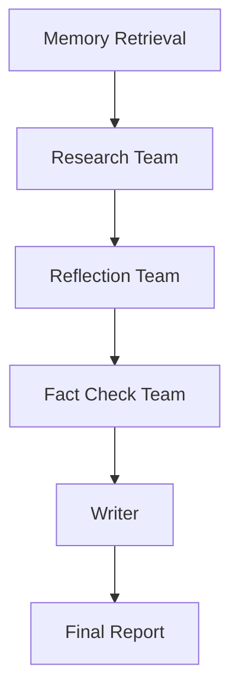
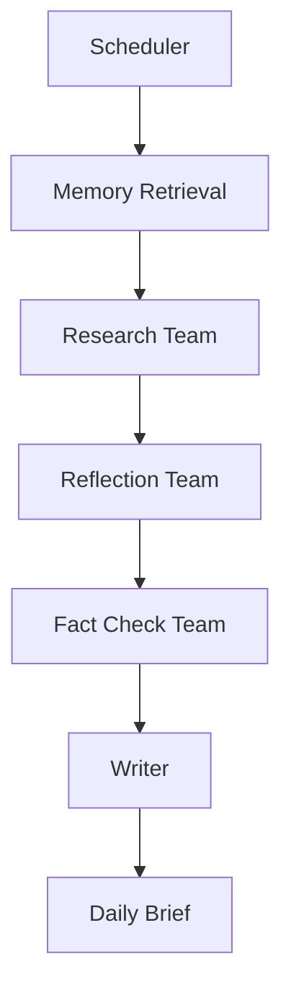

# PROS - Personal Research Operating System

## Overview

PROS is a workflow-centric, multi-agent research platform designed to perform deep research, generate personalized daily briefings, maintain long-term context, and provide production-grade observability.

## Architecture

```text
Workflow
    ↓
Agent Teams
    ↓
Tools
    ↓
Infrastructure
```

### Teams

- Research Team
- Reflection Team
- Fact Check Team
- Memory Team

### Artifact Flow

```text
ResearchArtifact
      ↓
ReflectionArtifact
      ↓
FactCheckArtifact
      ↓
FinalReport
```

## Technology Stack

| Layer | Technology |
|---------|------------|
| Language | Python 3.13 |
| Package Management | uv |
| API | FastAPI, Pydantic v2 |
| Workflow Engine | LangGraph |
| Agent Framework | LangChain Core |
| Research | Tavily |
| Memory | LangChain Memory + LangGraph Checkpointing |
| Relational Storage | PostgreSQL |
| Vector Storage | Qdrant |
| Cache | Redis |
| Scheduling | APScheduler |
| Observability | Langfuse, OpenTelemetry, Prometheus, Grafana |
| Evaluation | DeepEval |
| Deployment | Docker Compose |

## Workflows

### Research Workflow



### Daily Brief Workflow



## Status

Architecture Frozen

Next Milestone:
RFC-002 Artifact Contracts & Core Data Models
